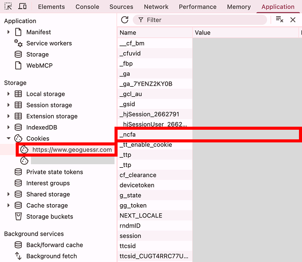

# GeoGuessr uploader (実験的ツール)

Valiが生成した `*-locations.json` を、Playwrightでブラウザ操作を自動化してGeoGuessrのマップエディタにインポート・公開するためのツールです。GeoGuessrには公開APIが存在しないため、実際のマップ作成UIを人間が操作するのと同じ手順でブラウザを動かしています。

**注意**: これは公式にサポートされた方法ではなく、GeoGuessr内部のUI構造に依存した非公式な自動化です。GeoGuessr側のUI変更で壊れる可能性があります。また、自分のアカウントで自分が作ったコンテンツをアップロードする用途を想定しています。

## セットアップ

```bash
cd tools/geoguessr-uploader
npm install
npx playwright install chromium
```

## 認証情報(`_ncfa` Cookie)の取得方法

GeoGuessrには公開APIがないため、ブラウザの「ログイン済みセッション」を表す `_ncfa` というCookieの値を使ってログイン状態を再現します。これは自分のアカウントに実際にログインした結果得られるCookieなので、Cloudflareの人間確認などは通常のブラウザ操作の中で人間(あなた)が完了させる形になります。

1. ブラウザで [geoguessr.com](https://www.geoguessr.com) に**普通にログイン**する
2. DevToolsを開く(Mac: `Cmd+Option+I` / Windows: `F12`)
3. **Application** タブ → 左メニュー **Storage → Cookies** → `https://www.geoguessr.com` を選択
4. 一覧から **`_ncfa`** を探し、**Value** 列の値をコピーする(長い暗号化された文字列。`%2B` や `%3D` のようなURLエンコードが含まれることがありますが、そのままコピーでOK)

   

5. このツールのディレクトリ(`tools/geoguessr-uploader/`)に `.env` ファイルを作り、以下のように書く:

   ```
   GEOGUESSR_NCFA=コピーした値
   ```

   `.env` は `.gitignore` に登録済みなので、誤ってcommitされることはありません。

### Cookieの有効期限について
`_ncfa` には有効期限があります。認証エラー(`Not authenticated` 等)が出たら、再度手動でログインし直してCookieを取得し直してください。

### セキュリティ上の注意
- `_ncfa` の値は実質的に「あなたのアカウントへのログイン」と同等の権限を持ちます。**他人に共有しない**でください。
- チャット等で一時的に共有した場合は、作業後にGeoGuessr側でログアウト(全セッション無効化)することを推奨します。
- `.env` や `storage-state.json`(後述)はどちらもgitignore対象です。

## 使い方

### 1回だけ地点をインポートしたい(公開はしない)

```bash
cd tools/geoguessr-uploader
set -a; source .env; set +a
node upload-map.mjs --name "MX-JAL" --file ../../mexico-states/mx-jal-locations.json
```

ドラフトとして保存され、`https://www.geoguessr.com/map-maker/<id>` の編集画面URLが表示されます(まだ他人には見えません)。

### インポートしてそのまま公開する

```bash
node upload-map.mjs --name "MX-JAL" --file ../../mexico-states/mx-jal-locations.json --publish
```

成功すると、公開マップのURL `https://www.geoguessr.com/maps/<id>` が最後に出力されます。**`--publish` を付けると他people(全体公開)に見える状態になります。** 一度公開すると簡単には取り消せない(非公開に戻す・削除する操作が別途必要)ので、名前やファイル内容を確認してから実行してください。

### 実行後にできること
- 初回実行時、ログイン済みセッションが `storage-state.json` に保存されます。以降は `.env` のCookieがなくても、このファイルがあれば同じセッションを再利用できます(ただし期限切れになったら再取得が必要)。
- スクリプト実行中にインポート後のスクリーンショットが `last-import-<mapId>.png` として保存されます(確認用)。

## 内部の仕組み(参考)

`upload-map.mjs` は以下をPlaywrightで自動操作しています:

1. `_ncfa` Cookieをセットしてブラウザコンテキストを作成
2. `/map-maker` を開き、マップ名を入力 → 「Handpicked locations」を選択 → 「Create map」
3. 遷移後のURL末尾がマップID(`map-maker/<id>`)
4. ヘッダー右側の「…」メニューを開き、「Import JSON file」でVali出力のJSONをそのままアップロード(変換不要)
5. (`--publish` 指定時)「Publish locations」→「YES, PUBLISH」で公開
6. 最終的なURLは `https://www.geoguessr.com/maps/<id>`(公開時)または `https://www.geoguessr.com/map-maker/<id>`(ドラフトのまま)

## ファイル一覧

| ファイル | 用途 |
|---|---|
| `upload-map.mjs` | 本体。1マップ分の作成・インポート・(任意で)公開を行うCLI |
| `.env` | Cookie等の秘匿情報(gitignore対象、各自で作成) |
| `storage-state.json` | Playwrightのログインセッション保存先(gitignore対象、自動生成) |
